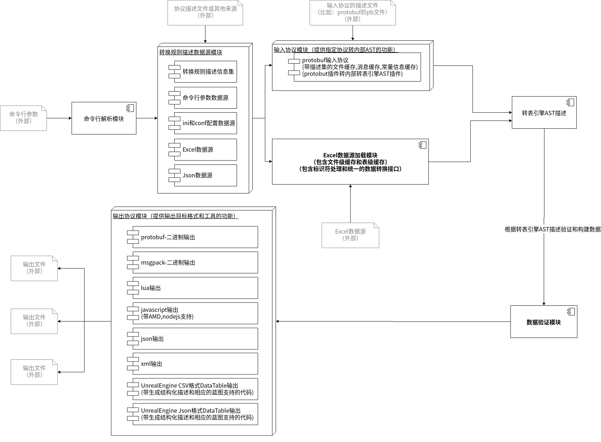

转表引擎设计模型
==============================

转表引擎是用于给各类其他工具集成的底层转表系统。所以它是一个没有用户界面的命令行工具。为了适应多种输入来源和多种输出目标，同时兼顾系统内缓存命中率，转表引擎工作的第一步是会先从输入的命令行参数或标准输入的参数中读取转表规则的来源和转换的目标类型；然后第二步是根据输入的规则描述文件选择相对应的解析模块，构建出完整的输入和输出的规则配置。接下来第三步转表引擎会根据这个配置选择结构化数据的描述解析模块（即：“输入协议模块”）读取整个数据结构的描述信息，并和读入Excel的列名相结合，构建出建立内部的抽象语法树（AST）。这一步的目的是实现把Excel中扁平化的数据描述翻译成结构化的数据描述；再进行第四步，把数据源中的每一行数据读取出来并构造出结构化的数据，并用数据验证器验证数据有效性。这一步的同时也可能会对数据做一些适配性质的处理。最后一步就是根据输出的类型，选取不同的输出模块写出到文件中。至此，转表的核心流程就完成了。

转表引擎架构和流程大致如下:

