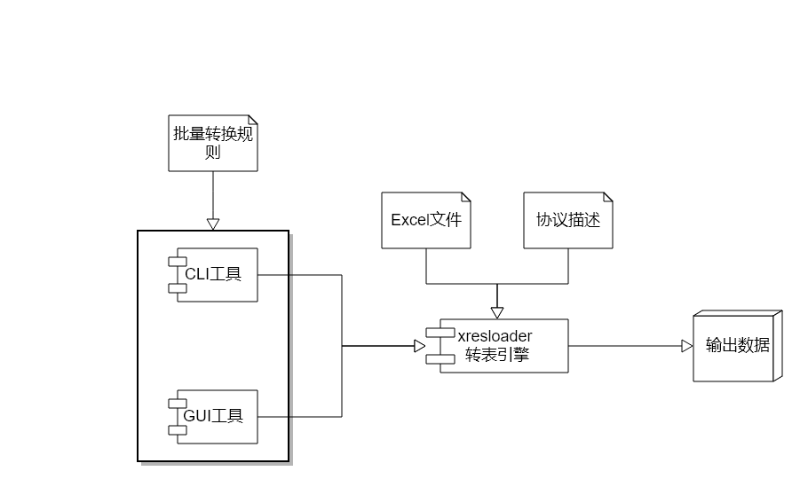
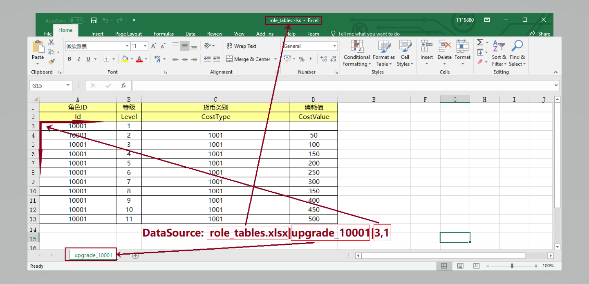
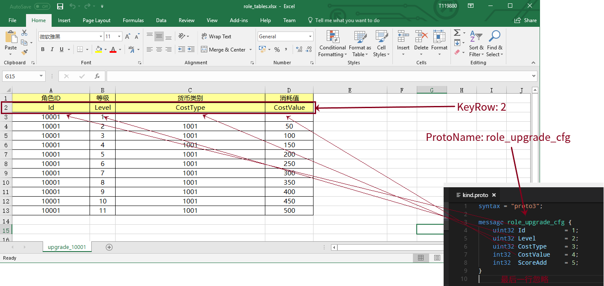
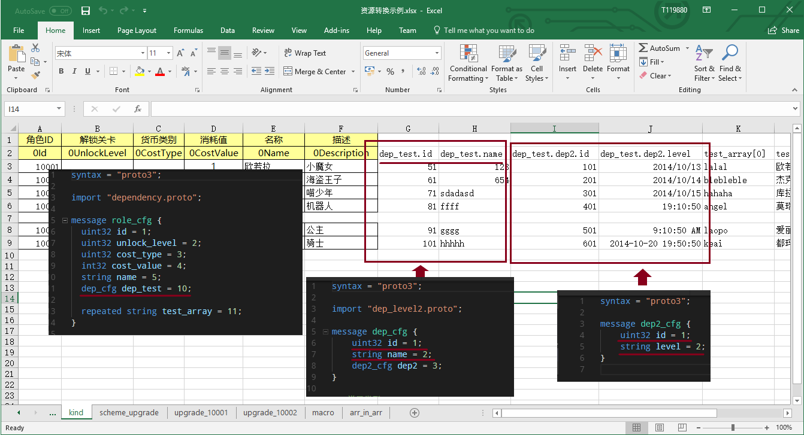
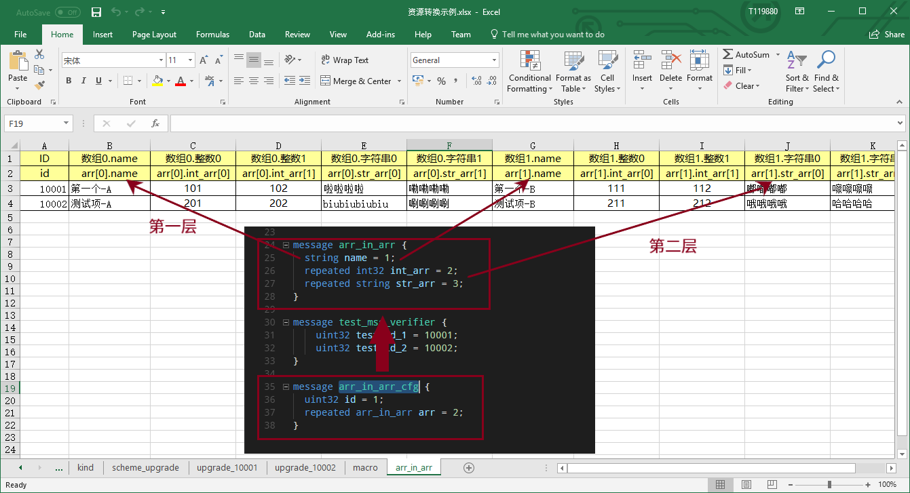

协议->Excel数据映射和支持的配置读取源 （scheme）
============================================================

.. _xresloader: https://github.com/xresloader/xresloader
.. _xresloader sample: https://github.com/xresloader/xresloader/tree/master/sample

在 :doc:`./quick_start` 章节里我们提供了一个基本的转表使用流程。整个流程图示如下：

上一章节里我们展示了 :doc:`./xresloader_core` 的最基础的使用方式。
在使用的时候，我们需要告诉 `xresloader`_ 怎么把Excel里的数据对引到协议的数据结构里。
本章节主要是针对 ``协议描述`` 的说明。

配置项的结构
---------------------------------------------

所有的数据源和规则设置都是Key-Value的形式。并且Value有三个，分别是**主配置，次要配置，补充配置**。
这三个参数对于不同配置的含义是不同的，具体没想配置的含义请参照 `data-mapping-available-options`_ 章节。

数据映射-Scheme
---------------------------------------------

我们通过一些列scheme的配置来告诉 `xresloader`_ 从Excel的哪些地方读取数据，又转化到协议的哪个数据结构和哪个字段中。

数据源
^^^^^^^^^^^^^^^^^^^^^^^^^^^^^^^^^^^^^^^^^^^^

我们通过 ``DataSource`` 来读取我们从哪个文件、哪个表及第几行第几列开始读数据。 比如：

然后再通过 ``ProtoName`` 和 ``KeyRow`` 来把Excel数据映射到哪个协议数据结构里和映射哪些字段。

类型嵌套和Message嵌套
^^^^^^^^^^^^^^^^^^^^^^^^^^^^^^^^^^^^^^^^^^^^
对于复杂的数据类型，我们使用 ``父级字段名.子结构字段名`` 来标识映射关系。比如在 `xresloader sample`_ 中。

以上划红线处为Excel ``KeyRow`` 配置和对应的协议结构。

数组和下标
^^^^^^^^^^^^^^^^^^^^^^^^^^^^^^^^^^^^^^^^^^^^

对于数组类型（protobuf的repeated类型）。我们使用 ``字段名[0开始的下标]`` 来表示。如果是数组嵌套数组，那么则是 ``父级字段名[父结构下标].子结构字段名[子结构下标]`` 。

以上示例是 `xresloader sample`_ 中的 ``arr_in_arr`` 表。

.. _data-mapping-available-options:

可用的配置项
---------------------------------------------

+-----------------------+------------------------+--------------------+--------------------+----------------------+------------------------------------+
| 字段                  | 简介                   | 主配置             | 次配置             | 补充配置             | 说明                               |
+=======================+========================+====================+====================+======================+====================================+
| DataSource            | 配置数据源             | 文件路径           | 表名               | 数据起始行号,列号    | **必须**。                         |
|                       |                        |                    |                    | (英文逗号分隔)       | 可多个。多个则表示把多个Excel表数  |
|                       |                        |                    |                    |                      | 据合并再生成配置输出，这意味着这多 |
|                       |                        |                    |                    |                      | 个Excel表的描述Key的顺序和个数必须 |
|                       |                        |                    |                    |                      | 相同。                             |
+-----------------------+------------------------+--------------------+--------------------+----------------------+------------------------------------+
| MacroSource           | 元数据数据源           | 文件路径           | 表名               | 数据起始行号,列号    | + **可选**                         |
|                       |                        |                    |                    | (英文逗号分隔)       |                                    |
+-----------------------+------------------------+--------------------+--------------------+----------------------+------------------------------------+
| 编程接口配置                                                                                                                                         |
+-----------------------+------------------------+--------------------+--------------------+----------------------+------------------------------------+
| ProtoName             | 协议描述名称           | 如: role_cfg       |                    |                      | + **必须**                         |
|                       |                        |                    |                    |                      | + 协议类型名称                     |
|                       |                        |                    |                    |                      | + 也可以是 ``包名`` . ``协议名``   |
+-----------------------+------------------------+--------------------+--------------------+----------------------+------------------------------------+
| OutputFile            | 输出文件               | 如: role_cfg.bin   |                    |                      | + **必须**                         |
+-----------------------+------------------------+--------------------+--------------------+----------------------+------------------------------------+
| KeyRow                | 字段名描述行           | 如: 2              |                    |                      | + **必须**                         |
+-----------------------+------------------------+--------------------+--------------------+----------------------+------------------------------------+
| KeyCase               | 字段名大小写           | 如: 小写           |                    |                      | + 字段名映射时的大小写转换         |
|                       |                        |                    |                    |                      | + 可选值: 大写/小写/不变           |
|                       |                        |                    |                    |                      | + 如果不需要则留空                 |
+-----------------------+------------------------+--------------------+--------------------+----------------------+------------------------------------+
| KeyWordSplit          | 字段名分词字符         |                    |                    |                      | + **可选**                         |
|                       |                        |                    |                    |                      | + 字段名映射时单词之间填充的字符串 |
|                       |                        |                    |                    |                      | + 如果不需要则留空                 |
+-----------------------+------------------------+--------------------+--------------------+----------------------+------------------------------------+
| KeyPrefix             | 字段名固定前缀         |                    |                    |                      | + **可选**                         |
|                       |                        |                    |                    |                      | + 字段名映射时附加的前缀           |
|                       |                        |                    |                    |                      | + 如果不需要则留空                 |
+-----------------------+------------------------+--------------------+--------------------+----------------------+------------------------------------+
| KeySuffix             | 字段名固定后缀         |                    |                    |                      | + **可选**                         |
|                       |                        |                    |                    |                      | + 字段名映射时附加的后缀           |
|                       |                        |                    |                    |                      | + 如果不需要则留空                 |
+-----------------------+------------------------+--------------------+--------------------+----------------------+------------------------------------+
| KeyWordRegex          | 分词规则（正则表达式） | 判断规则           | 移除分词符号规则   | 前缀过滤规则         | + **可选**                         |
|                       |                        |                    |                    |                      | + 字段名映射时单词的分词规则       |
|                       |                        |                    |                    |                      | + 正则表达式                       |
|                       |                        |                    |                    |                      | + 如果不需要则留空                 |
|                       | 示例:                  | [A-Z_$ \t\r\n]     | [_$ \t\r\n]        | [a-zA-Z_$]           |                                    |
+-----------------------+------------------------+--------------------+--------------------+----------------------+------------------------------------+
| Encoding              | 编码转换               | UTF-8              |                    |                      | 注：Google的protobuf库的代码里写死 |
|                       |                        |                    |                    |                      | 了UTF-8，故而该选项对Protobuf的二  |
|                       |                        |                    |                    |                      | 进制输出无效                       |
+-----------------------+------------------------+--------------------+--------------------+----------------------+------------------------------------+
| UeCfg-UProperty       | UnrealEngine配置       | 字段分组           | 蓝图权限           | 编辑权限             | + *可选*                           |
|                       | 支持的字段属性         | 默认值: XResConfig | 默认值: XResConfig | 默认值: EditAnywhere |                                    |
+-----------------------+------------------------+--------------------+--------------------+----------------------+------------------------------------+
| UeCfg-CaseConvert     | 是否开启驼峰命名转换   | true/false         |                    |                      | + *可选*                           |
|                       | （默认开启）           |                    |                    |                      | + 开启后将使用首字母大写的         |
|                       |                        |                    |                    |                      |   驼峰命名法生成字段名和类名       |
+-----------------------+------------------------+--------------------+--------------------+----------------------+------------------------------------+
| UeCfg-CodeOutput      | 设置UE代码输出目录     | 代码输出目录       | Publich目录前缀    | Private目录前缀      | + *可选*                           |
|                       |                        |                    |                    |                      | + 生成的cpp文件的包含路径和        |
|                       |                        |                    |                    |                      |   Publich目录前缀有关              |
+-----------------------+------------------------+--------------------+--------------------+----------------------+------------------------------------+
| UeCfg-DestinationPath | 资源输出目录           | 资源输出目录       |                    |                      | + *可选*                           |
|                       |                        |                    |                    |                      | + uassert目录，默认使用代码输出目录|
|                       |                        |                    |                    |                      |                                    |
+-----------------------+------------------------+--------------------+--------------------+----------------------+------------------------------------+

如果Excel里字段名使用上面示例里的规则，如果填的是 0UnlockLevel\_num，则会忽略第一个0（不符合前缀过滤规则）,按分词规则分词为Unlock、Level和num，
同时移除下划线分词符号（移除分词符号规则）。 然后按上面的大小写规则和 ``字段名分词字符`` 组成新的字段名，最后应用大小写规则。
假设 ``字段名分词字符`` 是 ``_`` 。 ``字段名大小写`` 是小写，则最后对应的协议的字段名是 ``unlock_level_num`` 。

字段名分词、大小写转换、等字段名转换的功能建议非必要不要使用。这里只是为了有些时候需要和其他工具搭配使用的时候的一些适配。

关于设置编码
^^^^^^^^^^^^^^^^^^^^^^^^^^^^^^^^^^^^^^^^^^^^^
由于protobuf里写死的UTF-8，所以编码设置不是对所有的功能都生效。如果输出的类型是代码文件或者文本文件，那么转表工具会尝试把文本内容转换成该编码。
对于二进制输出，这个选项是无效的。

从哪里读取字段映射信息？
---------------------------------------------

字段映射信息我们除了可以直接使用 :doc:`./xresloader_core` 的 ``-m`` 选项指定外，还支持多种读取来源。
如果从文件中读取，我们是根据文件后缀来区分读取来源的。

直接写在批量转表文件里（推荐）
^^^^^^^^^^^^^^^^^^^^^^^^^^^^^^^^^^^^^^^^^^^^^

在使用批量转表功能的时候建议直接写在批量转表配置里，详见 :doc:`./xresconv`

直接写在Excel里: 文件后缀.xls,.xlsx
^^^^^^^^^^^^^^^^^^^^^^^^^^^^^^^^^^^^^^^^^^^^^

当字段映射信息保存在Excel里时，scheme的名字就是表名（ ``-m`` 参数）。我们会先查找列明为 ``字段或header`` 、``主配置或major`` 、``次配置或minor`` 和 ``补充配置或addition`` 的字段，并依此列读取相应配置。如:

+-------------------+--------------------------------+-----------------------+----------------+-----------+----------------------------------------------------+ 
| 字段              | 简介                           | 主配置                | 次配置         | 补充配置  | 说明                                               |
+===================+================================+=======================+================+===========+====================================================+
| DataSource        | 配置数据源(文件路径,表名)      | 资源转换示例.xlsx     | upgrade_10001  | 3,1       | 次配置为表名，补充配置为数据起始位置(行号, 列号)   |
+-------------------+--------------------------------+-----------------------+----------------+-----------+----------------------------------------------------+
| DataSource        | 配置数据源(文件路径,表名)      |                       | upgrade_10002  | 3,1       | 次配置为表名，补充配置为数据起始位置(行号, 列号)   |
+-------------------+--------------------------------+-----------------------+----------------+-----------+----------------------------------------------------+
| MacroSource       | 元数据数据源(文件路径,表名)    | 资源转换示例.xlsx     | macro          | 2,1       | 次配置为表名，补充配置为数据起始位置(行号, 列号)   |
+-------------------+--------------------------------+-----------------------+----------------+-----------+----------------------------------------------------+
| 编程接口配置      |                                                                                                                                          |
+-------------------+--------------------------------+-----------------------+----------------+-----------+----------------------------------------------------+
| ProtoName         | 协议描述名称                   | role_upgrade_cfg      |                |           |                                                    |
+-------------------+--------------------------------+-----------------------+----------------+-----------+----------------------------------------------------+
| OutputFile        | 输出文件                       | role_upgrade_cfg.bin  |                |           |                                                    |
+-------------------+--------------------------------+-----------------------+----------------+-----------+----------------------------------------------------+
| KeyRow            | 字段名描述行                   | 2                     |                |           |                                                    |
+-------------------+--------------------------------+-----------------------+----------------+-----------+----------------------------------------------------+
| KeyCase           | 字段名大小写                   | 不变                  |                |           | 大写/小写/不变                                     |
+-------------------+--------------------------------+-----------------------+----------------+-----------+----------------------------------------------------+
| KeyWordSplit      | 字段名分词字符                 |                       |                |           |                                                    |
+-------------------+--------------------------------+-----------------------+----------------+-----------+----------------------------------------------------+
| KeyPrefix         | 字段名固定前缀                 |                       |                |           |                                                    |
+-------------------+--------------------------------+-----------------------+----------------+-----------+----------------------------------------------------+
| KeySuffix         | 字段名固定后缀                 |                       |                |           |                                                    |
+-------------------+--------------------------------+-----------------------+----------------+-----------+----------------------------------------------------+
| KeyWordRegex      | 分词规则                       |                       |                |           | (判断规则,移除分词符号规则,前缀过滤规则)正则表达式 |
+-------------------+--------------------------------+-----------------------+----------------+-----------+----------------------------------------------------+
| Encoding          | 编码转换                       | UTF-8                 |                |           |                                                    |             
+-------------------+--------------------------------+-----------------------+----------------+-----------+----------------------------------------------------+ 

直接写在json文件里: 文件后缀.json
^^^^^^^^^^^^^^^^^^^^^^^^^^^^^^^^^^^^^^^^^^^^^

当字段映射信息保存在Excel里时，我们认为json的根节点包含一个数组，下面时key-value类型数据，key为scheme的名字（ ``-m`` 参数）。里面还是Key-Value类型或Key-List类型。对应着每项配置。如： 

.. code-block:: json

    {
        "scheme_kind": {
            "DataSource": ["资源转换示例.xlsx", "kind", "3,1"],
            "MacroSource": ["资源转换示例.xlsx", "macro", "2,1"],

            "ProtoName": "role_cfg",
            "OutputFile": "role_cfg.bin",
            "KeyRow": 2,
            "KeyCase": "小写",
            "KeyWordSplit": "_",
            "KeyWordRegex": ["[A-Z_\\$ \\t\\r\\n]", "[_\\$ \\t\\r\\n]", "[a-zA-Z_\\$]"],
            "Encoding": "UTF-8"
        }
    }

直接写在ini文件里: 文件后缀.ini,.conf,.cfg
^^^^^^^^^^^^^^^^^^^^^^^^^^^^^^^^^^^^^^^^^^^^^

当字段映射信息保存在Excel里时，scheme的名字（ ``-m`` 参数）是section的名字，里面的数据是:

+ Key名称.0 => Key名称的主配置
+ Key名称.1 => Key名称的次配置
+ Key名称.2 => Key名称的补充配置

比如:

.. code-block:: ini

    [scheme_kind]
    DataSource.0 = 资源转换示例.xlsx
    DataSource.1 = kind
    DataSource.2 = 3,1

    MacroSource.0 = 资源转换示例.xlsx
    MacroSource.1 = macro
    MacroSource.2 = 2,1

    ProtoName = role_cfg
    OutputFile = role_cfg.bin
    KeyRow = 2
    KeyCase = 小写
    KeyWordSplit = _
    KeyWordRegex.0 = [A-Z_\$ \t\r\n]
    KeyWordRegex.1 = [_\$ \t\r\n]
    KeyWordRegex.2 = [a-zA-Z_\$]
    Encoding = UTF-8

完整的样例
---------------------------------------------

以上配置选项在 `xresloader sample`_ 中有完整的示例，并且在。 `xresloader`_ 的 ``README.md`` 中有举例说明。
