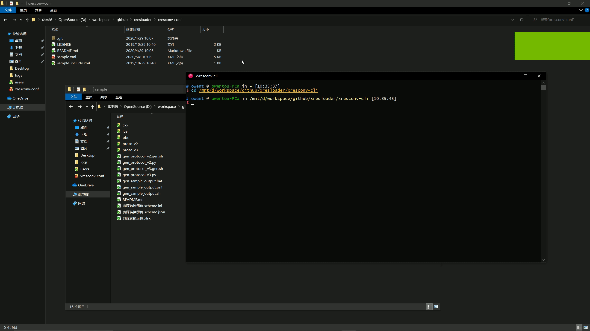
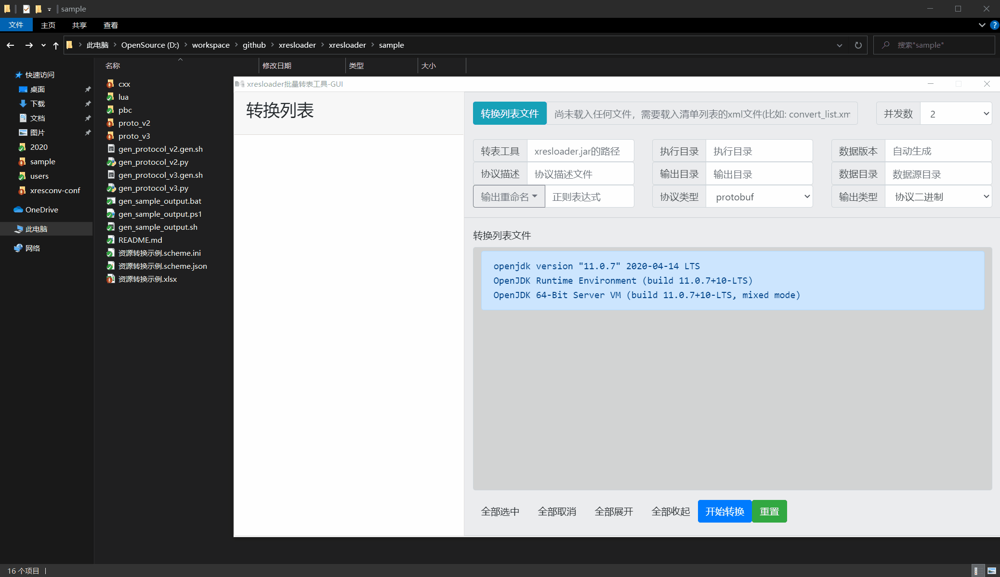

快速上手
===============

.. _kind.proto: https://github.com/xresloader/xresloader-docs/blob/master/source/sample/quick_start/sample-conf/kind.proto
.. _role_tables.xlsx: https://github.com/xresloader/xresloader-docs/blob/master/source/sample/quick_start/sample-conf/role_tables.xlsx
.. _sample.xml: https://github.com/xresloader/xresloader-docs/blob/master/source/sample/quick_start/sample-conf/sample.xml
.. _load_with_libresloader.cpp: https://github.com/xresloader/xresloader-docs/blob/master/source/sample/quick_start/sample-code/load_with_libresloader.cpp
.. _load_custom.cpp: https://github.com/xresloader/xresloader-docs/blob/master/source/sample/quick_start/sample-code/load_custom.cpp

.. _OpenJDK: https://developers.redhat.com/products/openjdk/download
.. _AdoptopenJDK: https://adoptopenjdk.net/
.. _LibericaJDK: https://bell-sw.com/
.. _Zulu: https://www.azul.com/downloads/zulu-community/

Step-1: 下载转表工具
-----------------------------------------------

#. 下载JRE/JDK 8或以上(推荐下载64位的: `AdoptopenJDK`_/`LibericaJDK`_/`OpenJDK`_/`Zulu`_)
#. 打开 :doc:`./download` 。下载最新版本的 **转表工具-xresloader** (xresloader-\*.jar)。
#. 下载或自己编译protobuf官方的protoc工具，可以去 https://github.com/google/protobuf/releases 下载预编译好的protoc
#. [可选/推荐] 如果要使用命令行版本的批量转换工具则要额外下载 **命令行批量转表工具-xresconv-cli**
#. [可选/推荐] 如果要使用GUI版本的批量转换工具则要额外下载 **GUI批量转表工具-xresconv-gui**

Step-2: 配置结构化的protobuf协议并使用protoc
-----------------------------------------------
我们需要先写协议描述文件，到时候转出的数据也是按这个结构打包的。比如： `kind.proto`_ 

.. literalinclude:: ../sample/quick_start/sample-conf/kind.proto
    :language: proto
    :encoding: utf-8

proto v2也可以，可以参见 https://github.com/xresloader/xresloader/blob/master/sample/proto_v2/kind.proto 。

然后使用protoc生成描述文件和用于加载的代码文件: ::

    protoc -I sample-conf -o sample-conf/kind.pb --cpp_out=sample-code sample-conf/kind.proto ;

这是最终的 **数据转出目标** 。

Step-3: 配置Excel数据源
-----------------------------------------------

按照协议的配置编辑Excel文件，`role_tables.xlsx`_ ，我们使用表名 ``upgrade_10001`` 。
第一行设为描述，第二行设置为字段映射列，后面是数据(具体设置请参照 :ref:`quick-start-configure-sheme`)。

+-----------+---------+-------------+--------------+
|  角色ID   |   等级  |   货币类别  |   消耗值     |
+===========+=========+=============+==============+
|   Id      | Level   | CostType    | CostValue    |
+-----------+---------+-------------+--------------+
|   10001   | 1       |             |              |
+-----------+---------+-------------+--------------+
|   10001   | 2       | 1001        | 50           |
+-----------+---------+-------------+--------------+
|   10001   | 3       | 1001        | 100          |
+-----------+---------+-------------+--------------+
|   10001   | 4       | 1001        | 150          |
+-----------+---------+-------------+--------------+
|   10001   | 5       | 1001        | 200          |
+-----------+---------+-------------+--------------+
|   10001   | 6       | 1001        | 250          |
+-----------+---------+-------------+--------------+
|   10001   | 7       | 1001        | 300          |
+-----------+---------+-------------+--------------+
|   10001   | 8       | 1001        | 350          |
+-----------+---------+-------------+--------------+
|   10001   | 9       | 1001        | 400          |
+-----------+---------+-------------+--------------+
|   10001   | 10      | 1001        | 450          |
+-----------+---------+-------------+--------------+
|   10001   | 11      | 1001        | 500          |
+-----------+---------+-------------+--------------+

这是最终的 **数据来源** 。

.. _quick-start-configure-sheme:

Step-4: 配置批量转表配置文件
-----------------------------------------------

编辑配置转表配置， `sample.xml`_ 。这个文件用于告诉批量转表工具，xresloader的位置、工作目录从哪里读协议描述文件，如果映射字段转成什么类型等等。
简而言之就是把 **数据转出目标** 和 **数据来源** 关联起来。

.. literalinclude:: ../sample/quick_start/sample-conf/sample.xml
    :language: xml
    :encoding: utf-8

对于文件路径配置的说明: ``work_dir`` 、 ``xresloader_path`` 和 ``include`` 配置的路径是相对于xml文件的路径。其他的涉及路径配置的地方如果不是绝对路径的，都是相对于 ``work_dir`` 的路径。（具体含义请参考 :doc:`./xresconv` ）

在查找Excel文件的时候，如果有配置 ``data_src_dir`` ，则会相对于这个配置的路径读取Excel，否则也是相对于 ``work_dir`` 。

Step-5: 运行转表工具
-----------------------------------------------

下面两种运行转表的工具，一种是命令行工具，另一种是有用户界面的GUI工具。选用一种即可。

我们假设执行环境的目录结构如下:

* 执行目录:

  * sample-conf (批量转表配置所在目录)

    * sample.xml
    * kind.proto
    * kind.pb               （使用protoc生成的二进制协议描述文件）
    * role_tables.xlsx      （Excel数据源）
    * xresloader.run.log     (输出的日志文件，执行转表后自动生成，方便万一有错误排查)

  * sample-data (转出的配置数据所在目录)

    * role_upgrade_cfg.bin  (输出的二进制配置文件，执行转表后自动生成)

  * xresloader

    * header

      * pb_header.proto    （用于proto v2的转表头结构描述文件，读取数据的时候用）
      * pb_header_v3.proto （用于proto v3的转表头结构描述文件，读取数据的时候用）

    * target (下载的xresloader所在目录)

      * xresloader-1.4.3.jar

  * xresconv-cli (命令行转表工具所在目录)

    * xresconv-cli.py
    * print_color.py

  * xresconv-gui (GUI转表工具所在目录)

    * GUI工具的文件列表
  

Step-5.1: 命令行批量转表工具
^^^^^^^^^^^^^^^^^^^^^^^^^^^^^^^^^^^^^^^^^^^^^^

.. code-block:: bash

    python xresconv-cli/xresconv-cli.py sample-conf/sample.xml

输出如下:

Step-5.2: GUI批量转表工具
^^^^^^^^^^^^^^^^^^^^^^^^^^^^^^^^^^^^^^^^^^^^^^

使用GUI工具，直接加载配置文件，选中要转换的表然后点击开始即可。

Step-6: 加载数据
-----------------------------------------------

执行完上面一步的转表流程后，我们得到了 ``xresloader/sample/role_upgrade_cfg.bin`` 这个二进制配置文件，接下来把它加载到我们的程序中就可以了。

比如我们用C++来加载。首先我们之前执行 ``protoc`` 的时候已经生成了配置协议的代码，然后还需要生成转表工具header的结构的代码。 ::

    protoc -I xresloader/header --cpp_out=sample-code xresloader/header/pb_header_v3.proto ;

然后你可以选择使用我们封装过的读取库解析或手动解析。

.. _quick_start-load-with-libresloader:

Step-6.1: 使用读取库解析
^^^^^^^^^^^^^^^^^^^^^^^^^^^^^^^^^^^^^^^^^^^^^^

需要先下载读取库。 ::

    curl -L -k https://raw.githubusercontent.com/xresloader/xresloader/master/loader-binding/cxx/libresloader.h -o libresloader.h

然后读取的代码sample如下（文件名: `load_with_libresloader.cpp`_ ） 

.. literalinclude:: ../sample/quick_start/sample-code/load_with_libresloader.cpp
    :language: cpp
    :encoding: utf-8

编译和运行：

.. code-block:: bash

    g++ -I . -I<protobuf的include目录> -L<protobuf的lib目录> -std=c++11 -O0 -g -ggdb -Wall load_with_libresloader.cpp *.pb.cc -lprotobuf -o load_with_libresloader.exe && ./load_with_libresloader.exe ../sample-data/role_upgrade_cfg.bin

输出示例：

.. code-block:: bash

    Id: 10001
    Level: 4
    CostType: 1001
    CostValue: 150

    role_upgrade_cfg with id=10001 has 11 items
    Id: 10001
    Level: 1

Step-6.2: 手动解析
^^^^^^^^^^^^^^^^^^^^^^^^^^^^^^^^^^^^^^^^^^^^^^

手动解析的流程是先用 `xresloader中header <https://github.com/xresloader/xresloader/blob/master/header/pb_header_v3.proto>`_ 里的 ``xresloader_datablocks`` 解析二进制文件，然后用协议的proto解析里面每条 ``data_block`` 字段。
每个 ``data_block`` 的条目对应配置里协议的每个message。（文件名: `load_custom.cpp`_ ）：

.. literalinclude:: ../sample/quick_start/sample-code/load_custom.cpp
    :language: cpp
    :encoding: utf-8

编译和运行：

.. code-block:: bash

    g++ -I . -I<protobuf的include目录> -L<protobuf的lib目录> -std=c++11 -O0 -g -ggdb -Wall load_custom.cpp *.pb.cc -lprotobuf -o load_custom.exe && ./load_custom.exe ../sample-data/role_upgrade_cfg.bin

输出示例：

.. code-block:: bash

    ========================
    data header: xres_ver: "1.4.3"
    data_ver: "1.4.3.20180317040504"
    count: 11
    hash_code: "md5:7bbe88cca1eb23ebdce75b0e10b88b4a"

    ========================
    role_upgrade_cfg => index 0: Id: 10001 Level: 1
    role_upgrade_cfg => index 1: Id: 10001 Level: 2 CostType: 1001 CostValue: 50
    role_upgrade_cfg => index 2: Id: 10001 Level: 3 CostType: 1001 CostValue: 100
    role_upgrade_cfg => index 3: Id: 10001 Level: 4 CostType: 1001 CostValue: 150
    role_upgrade_cfg => index 4: Id: 10001 Level: 5 CostType: 1001 CostValue: 200
    role_upgrade_cfg => index 5: Id: 10001 Level: 6 CostType: 1001 CostValue: 250
    role_upgrade_cfg => index 6: Id: 10001 Level: 7 CostType: 1001 CostValue: 300
    role_upgrade_cfg => index 7: Id: 10001 Level: 8 CostType: 1001 CostValue: 350
    role_upgrade_cfg => index 8: Id: 10001 Level: 9 CostType: 1001 CostValue: 400
    role_upgrade_cfg => index 9: Id: 10001 Level: 10 CostType: 1001 CostValue: 450
    role_upgrade_cfg => index 10: Id: 10001 Level: 11 CostType: 1001 CostValue: 500

加载数据可以有多种方法，这里提供加载二进制的方法。 更多关于输出类型和加载方式的信息请参见 :doc:`./output_format` 。

上面的历程和配置可以在 https://github.com/xresloader/xresloader-docs/tree/master/source/sample/quick_start 查看。

使用proto v2加载二进制数据的特别注意事项
-----------------------------------------------
需要额外注意一点的是，如果使用proto v2生成的代码或pb加载转出的数据，如果有 ``repeated`` 的数字字段，需要在proto文件里显式指明 ``packed`` 属性。

详见 :ref:`output-format-proto v2 and proto v3`
