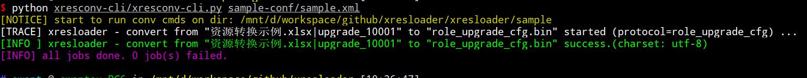
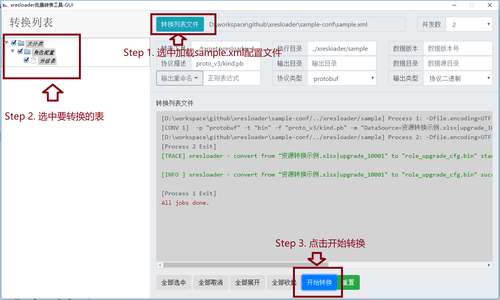

快速上手
===============

.. _kind.proto: https://github.com/xresloader/xresloader/blob/master/sample/proto_v3/kind.proto
.. _资源转换示例.xlsx: https://github.com/xresloader/xresloader/blob/master/sample/%E8%B5%84%E6%BA%90%E8%BD%AC%E6%8D%A2%E7%A4%BA%E4%BE%8B.xlsx
.. _sample.xml: https://github.com/xresloader/xresconv-conf/blob/master/sample.xml

Step-1: 下载转表工具
-----------------------------------------------

#. 打开 :doc:`download` 。下载最新版本的 **转表工具-xresloader** (xresloader-\*.jar)。
#. 如果要使用命令行版本的批量转换工具则要额外下载 **命令行批量转表工具-xresconv-cli**
#. 如果要使用GUI版本的批量转换工具则要额外下载 **GUI批量转表工具-xresconv-gui**
#. 下载或自己编译protobuf官方的protoc工具，可以去 https://github.com/google/protobuf/releases 下载预编译好的protoc

Step-2: 配置结构化的protobuf协议并使用protoc
-----------------------------------------------
我们需要先写协议描述文件，到时候转出的数据也是按这个结构打包的。比如，`kind.proto`_: ::

    syntax = "proto3";
    message role_upgrade_cfg {
        uint32 Id = 1;
        uint32 Level = 2;
        uint32 CostType = 3;
        int32 CostValue = 4;
        int32 ScoreAdd = 5;
    }

proto v2也可以，可以参见 https://github.com/xresloader/xresloader/blob/master/sample/proto_v2/kind.proto 。

然后使用protoc生成描述文件和用于加载的代码文件: ::

    protoc -I . -o xresloader/sample/proto_v3/kind.pb --cpp_out=. kind.proto ;

这是最终的 **数据转出目标** 。

Step-3: 配置Excel数据源
-----------------------------------------------

按照协议的配置编辑Excel文件，`资源转换示例.xlsx`_ ，我们使用表名 ``upgrade_10001`` 。
第一行设为描述，第二行设置为字段映射列，后面是数据(具体设置请参照 :ref:`quick-start-configure-sheme`)。

+-----------+---------+-------------+--------------+
|  角色ID   |   等级  |   货币类别  |   消耗值     |
+===========+=========+=============+==============+
|   Id      | Level   | CostType    | CostValue    |
+-----------+---------+-------------+--------------+
|   10001   | 1       |             |              |
+-----------+---------+-------------+--------------+
|   10001   | 2       | 10001       | 50           |
+-----------+---------+-------------+--------------+
|   10001   | 3       | 10001       | 100          |
+-----------+---------+-------------+--------------+
|   10001   | 4       | 10001       | 150          |
+-----------+---------+-------------+--------------+
|   10001   | 5       | 10001       | 200          |
+-----------+---------+-------------+--------------+
|   10001   | 6       | 10001       | 250          |
+-----------+---------+-------------+--------------+
|   10001   | 7       | 10001       | 300          |
+-----------+---------+-------------+--------------+
|   10001   | 8       | 10001       | 350          |
+-----------+---------+-------------+--------------+
|   10001   | 9       | 10001       | 400          |
+-----------+---------+-------------+--------------+
|   10001   | 10      | 10001       | 450          |
+-----------+---------+-------------+--------------+
|   10001   | 11      | 10001       | 500          |
+-----------+---------+-------------+--------------+

这是最终的 **数据来源** 。

.. _quick-start-configure-sheme:

Step-4: 配置批量转表配置文件
-----------------------------------------------

编辑配置转表配置，`sample.xml`_ 。这个文件用于告诉批量转表工具，xresloader的位置、工作目录从哪里读协议描述文件，如果映射字段转成什么类型等等。
简而言之就是把 **数据转出目标** 和 **数据来源** 关联起来。

::

    <?xml version="1.0" encoding="UTF-8"?>
    <root>
        <global>
            <work_dir desc="工作目录，相对于当前xml的目录，我们的Excel文件放在这里">../xresloader/sample</work_dir>
            <xresloader_path desc="指向前面下载的 转表工具-xresloader，相对于当前xml的目录">../target/xresloader-1.4.1.jar</xresloader_path>

            <proto desc="协议类型，-p选项">protobuf</proto>
            <output_type desc="输出类型，对饮-t选项，输出二进制">bin</output_type>
            <proto_file desc="协议描述文件，-f选项">proto_v3/kind.pb</proto_file>

            <output_dir desc="输出目录，-o选项"></output_dir>
            <data_src_dir desc="数据源目录，-d选项"></data_src_dir>

            <java_option desc="java选项-最大内存限制2GB">-Xmx2048m</java_option>
            <java_option desc="java选项-客户端模式">-client</java_option>

            <default_scheme name="KeyRow" desc="默认scheme模式参数-Key行号，对应上面Id、Level、CostType、CostValue那一行">2</default_scheme>
        </global>
        
        <groups desc="分组信息（可选）">
            <group id="client" name="客户端"></group>
            <group id="server" name="服务器"></group>
        </groups>

        <category desc="类信息（用于GUI工具的树形结构分类显示）">
            <tree id="all_cats" name="大分类">
                <tree id="kind" name="角色配置"></tree>
            </tree>
        </category>

        <list>
            <item name="升级表" cat="kind" class="client server">
                <scheme name="DataSource" desc="数据源(文件名|表名|数据起始行号,数据起始列号)">资源转换示例.xlsx|upgrade_10001|3,1</scheme>
                <scheme name="ProtoName" desc="协议名">role_upgrade_cfg</scheme>
                <scheme name="OutputFile" desc="输出文件名">role_upgrade_cfg.bin</scheme>
            </item>
        </list>
    </root>

对于文件路径配置的说明: ``work_dir`` 、 ``xresloader_path`` 和 ``include`` （具体含义请参考 :doc:`./advance_usage` ） 配置的路径是相对于xml文件的路径。其他的涉及路径配置的地方如果不是绝对路径的，都是相对于 ``work_dir`` 的路径。

在查找Excel文件的时候，如果有配置 ``data_src_dir`` ，则会相对于这个配置的路径读取Excel，否则也是相对于 ``work_dir`` 。

Step-5: 运行转表工具
-----------------------------------------------

下面两种运行转表的工具，一种是命令行工具，另一种是有用户界面的GUI工具。选用一种即可。

我们假设执行环境的目录结构如下:

* 执行目录:

  * sample-conf (批量转表配置所在目录)

    * sample.xml

  * xresloader

    * header

      * pb_header.proto    （用于proto v2的转表头结构描述文件，读取数据的时候用）
      * pb_header_v3.proto （用于proto v3的转表头结构描述文件，读取数据的时候用）

    * sample (数据源)

      * 资源转换示例.xlsx
      * role_upgrade_cfg.bin  (输出的二进制配置文件，执行转表后自动生成)
      * xresloader.run.log    (输出的日志文件，执行转表后自动生成，方便万一有错误排查)
      * proto_v3
        
        * kind.pb  （使用protoc生成的二进制协议描述文件）

    * target (下载的xresloader所在目录)

      * xresloader-1.4.1.jar

  * xresconv-cli (命令行转表工具所在目录)

    * xresconv-cli.py
    * print_color.py

  * xresconv-gui (GUI转表工具所在目录)

    * GUI工具的文件列表
  

Step-5.1: 命令行批量转表工具
^^^^^^^^^^^^^^^^^^^^^^^^^^^^^^^^^^^^^^^^^^^^^^

::

    python xresconv-cli/xresconv-cli.py sample-conf/sample.xml

输出如下:

Step-5.2: GUI批量转表工具
^^^^^^^^^^^^^^^^^^^^^^^^^^^^^^^^^^^^^^^^^^^^^^

使用GUI工具，直接加载配置文件，选中要转换的表然后点击开始即可。

Step-6: 加载数据
-----------------------------------------------

执行完上面一步的转表流程后，我们得到了 ``xresloader/sample/role_upgrade_cfg.bin`` 这个二进制配置文件，接下来把它加载到我们的程序中就可以了。

比如我们用C++来加载。首先我们之前执行 ``protoc`` 的时候已经生成了配置协议的代码，然后还需要生成转表工具header的结构的代码。 ::

    protoc -I xresloader/header --cpp_out=. xresloader/header/pb_header_v3.proto ;

然后你可以选择使用我们封装过的读取库解析或手动解析。

Step-6.1: 使用读取库解析
^^^^^^^^^^^^^^^^^^^^^^^^^^^^^^^^^^^^^^^^^^^^^^

需要先下载读取库。 ::

    curl -L -k https://raw.githubusercontent.com/xresloader/xresloader/master/loader-binding/cxx/libresloader.h -o libresloader.h

然后读取的代码sample如下 

::

    #include <cstdio>
    #include <iostream>
    #include <fstream>

    #include "kind.pb.h"
    #include "libresloader.h"

    int main(int argc, char* argv[]) {

        const char* file_path = "xresloader/sample/role_upgrade_cfg.bin";
        if (argc > 1) {
            file_path = argv[1];
        } else {
            printf("usage: %s <path to role_upgrade_cfg.bin>\n", argv[0]);
            return 1;
        }

        // key - value 型数据读取机制
        do {
            typedef xresloader::conf_manager_kv<role_upgrade_cfg, uint32_t, uint32_t> kind_upg_cfg_t;
            kind_upg_cfg_t upg_mgr;
            upg_mgr.set_key_handle( {
                return kind_upg_cfg_t::key_type(p->id(), p->level());
            });

            upg_mgr.load_file(file_path);

            kind_upg_cfg_t::value_type data1 = upg_mgr.get(10001, 4); // 获取Key 为 10001,4的条目
            if (NULL == data1) {
                std::cerr<< "role_upgrade_cfg id: 10001, level: 4 not found, load file "<< file_path<< " failed."<< std::endl;
                break;
            }

            printf("%s\n", data1->DebugString().c_str());
        } while(false);

        // key - list 型数据读取机制
        do {
            typedef xresloader::conf_manager_kl<role_upgrade_cfg, uint32_t> kind_upg_cfg_t;
            kind_upg_cfg_t upg_mgr;
            upg_mgr.set_key_handle( {
                return kind_upg_cfg_t::key_type(p->id());
            });

            upg_mgr.load_file(file_path);
            printf("role_upgrade_cfg with id=%d has %llu items\n", 10001, static_cast<unsigned long long>(upg_mgr.get_list(10001)->size()));

            kind_upg_cfg_t::value_type data1 = upg_mgr.get(10001, 0); // 获取Key 为 10001 下标为0（就是第一个）条目
            if (NULL == data1) {
                std::cerr<< "role_upgrade_cfg id: 10001 , index: 0, not found, load file "<< file_path<< " failed."<< std::endl;
                break;
            }
            
            printf("%s\n", data1->DebugString().c_str());
        } while(false);

        return 0;
    }

Step-6.2: 手动解析
^^^^^^^^^^^^^^^^^^^^^^^^^^^^^^^^^^^^^^^^^^^^^^

手动解析的流程是先用 `xresloader中header <https://github.com/xresloader/xresloader/blob/master/header/pb_header_v3.proto>`_ 里的 ``xresloader_datablocks`` 解析二进制文件，然后用协议的proto解析里面每条 ``data_block`` 字段。
每个 ``data_block`` 的条目对应配置里协议的每个message。

::

    #include <cstdio>
    #include <iostream>
    #include <fstream>
    #include <google/protobuf/stubs/common.h>

    #if GOOGLE_PROTOBUF_VERSION < 3000000
    #include "pb_header.pb.h"
    #else
    #include "pb_header_v3.pb.h"
    #endif

    #include "kind.pb.h"

加载数据可以有多种方法，这里提供加载二进制的方法。 更多关于输出类型和加载方式的信息请参见 :doc:`./output_format`

