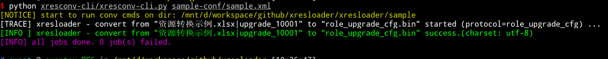
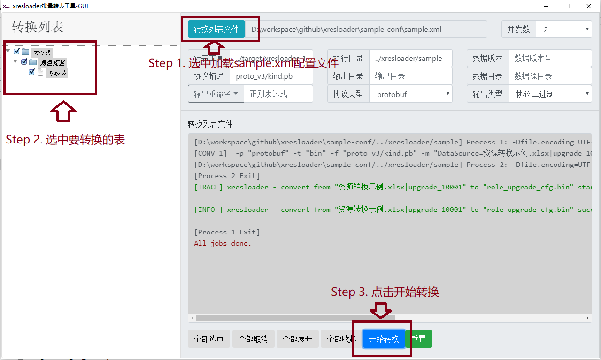

批量转表工具
=============================================

.. _xresloader: https://github.com/xresloader/xresloader
.. _xresconv-cli: https://github.com/xresloader/xresconv-cli
.. _xresconv-gui: https://github.com/xresloader/xresconv-gui
.. _xresconv-conf: https://github.com/xresloader/xresconv-conf

在实际项目中，我们一般会同时涉及几十甚至上百张表。为了统一配置，我们提供了批量转表工具。
批量转表分为 命令行批量转表工具-`xresconv-cli`_ 和 GUI批量转表工具-`xresconv-gui`_ 两个工具。

前者用于服务器和客户端发布流程的集成，后者主要提供给临时转表和策划验证数据时可以拿来转出部分数据。
这两个工具都以 `批量转表配置模板仓库-xresconv-conf <xresconv-conf>`_ 中的配置为配置规范。

以上为 命令行批量转表工具-`xresconv-cli`_ 的输出示例。

以上为 GUI批量转表工具-`xresconv-gui`_ 的输出示例。

我们在 :ref:`快速上手-配置批量转表配置文件 <quick-start-configure-sheme>` 章节里也提供了一个简单的例子：

.. literalinclude:: ../sample/quick_start/sample-conf/sample.xml
    :language: xml
    :encoding: utf-8

更多具体的配置说明如下： 

.. literalinclude:: ../sample/xresconv_conf.xml
    :language: xml
    :encoding: utf-8

如上是所有支持的标签的说明及示例配置。

除了前面章节提及过的字段外，还有一些特别的配置。

+ ``//root/include`` : 包含其他配置文件。相当于把其他配置文件离得配置复制过来。然后这个文件里有重复得配置则覆盖之。
+ ``//root/global/work_dir`` : 运行 `xresloader`_ 的目录。如果是相对目录的话相对于xml配置文件。
+ ``//root/global/xresloader_path`` : `xresloader`_ 的jar包的路径。如果是相对目录的话相对于xml配置文件。
+ ``//root/global/java_option`` : 用于传给java命令。所有的条目都会附加到java选项种。比如示例种的 ``-Xmx2048m`` 用于设置最大堆为2GB，用于对于比较大的Excel导表的时候可能会临时占用较高内存。
+ ``//root/global/default_scheme`` : 默认的导表映射关系的配置（详见 :ref:`data-mapping-available-options` ）。对所有转换条目都会附加这里面的配置项。可多个。
+ ``//root/list/item/scheme`` : 导表映射关系的配置（详见 :ref:`data-mapping-available-options` ）。如果和上面 ``default_scheme``  冲突则会覆盖默认配置，仅对这个条目生效。可多个。
+ ``//root/list/item/option`` : 运行 `xresloader`_ 的额外附加参数（详见 :doc:`./xresloader_core` ）。比如使用 ``--enable-empty-list`` 可以不移除Excel里的空数据，仅对这个条目生效。可多个。

GUI批量转表工具的特殊事件
---------------------------------------------

其他得配置看内容应该比较容易理解，但是 GUI工具 `xresconv-gui`_ 还有一些额外的配置，遍域用来做工具集成，需要特别说明一下

第一个是 ``//root/gui/set_name`` 这是里面必须是一个有效的nodejs代码，传入的参数是：

.. code-block:: javascript

    {
        work_dir: "工作目录(要求版本>=2.2.0)",
        configure_file: "载入的配置文件路径(要求版本>=2.2.0)",
        item_data: {
            id: "条目ID",
            file: "数据源文件",
            scheme: "数据源scheme表名",
            name: "描述名称",
            cat: "分类名称",
            options: ["额外选项"],
            desc: "描述信息",
            scheme_data: {"元数据Key": "元数据Value"}
        },
        alert_warning: function(content, title, options) {},    // (要求版本>=2.2.0) 警告弹框， options 结构是 {yes: 点击是按钮回调, no: 点击否按钮回调, on_close: 关闭后回调}
        alert_error: function(content, title) {},               // (要求版本>=2.2.0) 错误弹框
        log_info: function (content) {},                        // (要求版本>=2.2.0) 打印info日志
        log_error: function (content) {}                        // (要求版本>=2.2.0) 打印info日志
    }

这个结构。在 GUI工具 `xresconv-gui`_ 显示每个条目的时候会运行这个函数并传入上述结构，在函数里我们可以通过改变 ``name`` 和 ``desc`` 来改变 GUI工具 `xresconv-gui`_ 工具的显示内容。

比如 `批量转表配置模板仓库-xresconv-conf <xresconv-conf>`_ 中的 ``sample.xml`` 文件，我们给所有条目的名字附加上了不带后缀的文件名。

另外还有 ``//root/gui/on_before_convert`` 和 ``//root/gui/on_after_convert`` ，用于在开始转表流程的前和后执行自定义脚本，便于流程集成。
在这是里面必须是一个有效的nodejs代码，其中 ``//root/gui/on_before_convert[timeout]`` 和 ``//root/gui/on_after_convert[timeout]`` 可以用于控制超时时间，单位是毫秒。
传入的参数是：

.. code-block:: javascript

    {
        work_dir: "执行xresloader的工作目录",
        configure_file: "载入的配置文件路径(要求版本>=2.2.0)",
        xresloader_path: "xresloader目录",
        global_options: {"全局选项": "VALUE"},
        selected_nodes: ["选中要执行转表的节点集合"],
        run_seq: "执行序号",
        alert_warning: function(content, title, options) {},    // 警告弹框， options 结构是 {yes: 点击是按钮回调, no: 点击否按钮回调, on_close: 关闭后回调}
        alert_error: function(content, title) {},               // 错误弹框
        log_info: function (content) {},                        // 打印info日志
        log_error: function (content) {},                       // 打印info日志
        resolve: function (value) {},                           // 通知上层执行结束,相当于Promise的resolve
        reject: function(reason) {},                            // 通知上层执行失败,相当于Promise的reject
        require: function (name) {}                             // 相当于 nodejs的 require(name) 用于导入nodejs 模块
    }

在 `批量转表配置模板仓库-xresconv-conf <xresconv-conf>`_ 中的 ``sample.xml`` 文件中也有示例。
